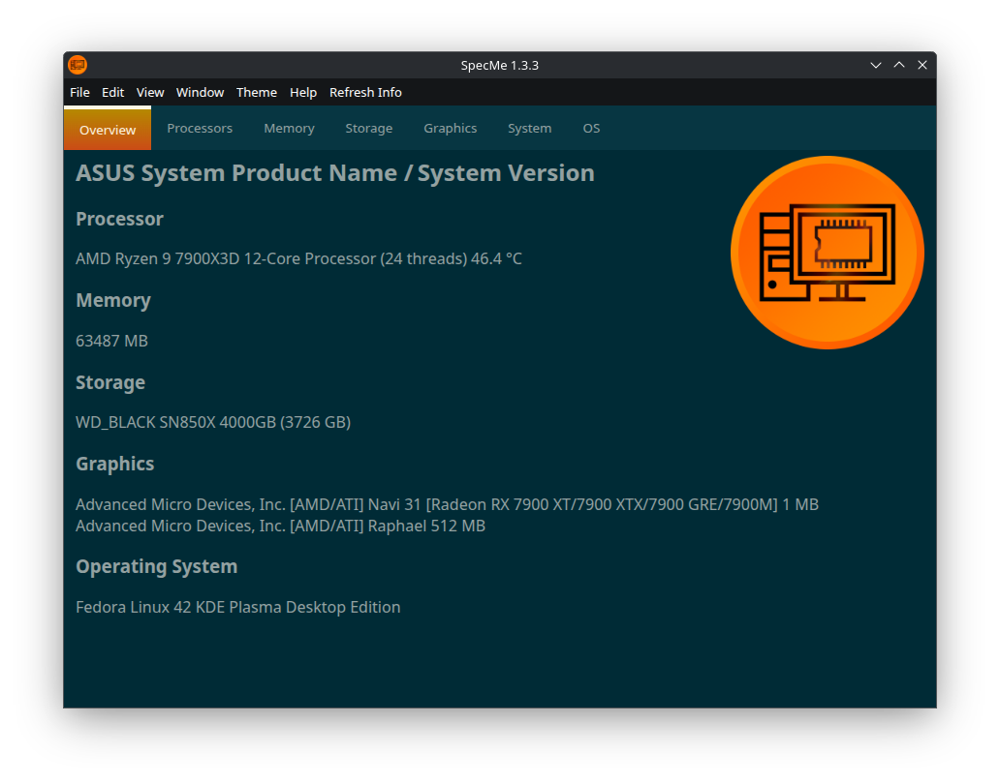

SpecMe is a free and open-source system specification viewer written in Electron. It will run on Windows, macOS, and Linux.

To run:
1. `npm install`
2. `npm run start`
   
To compile:
1. `npm install`
2. `npm run make`

If you are compiling on a Mac, you will need an additional package to get correct CPU temperature readings:
`npm install osx-temperature-sensor --save`